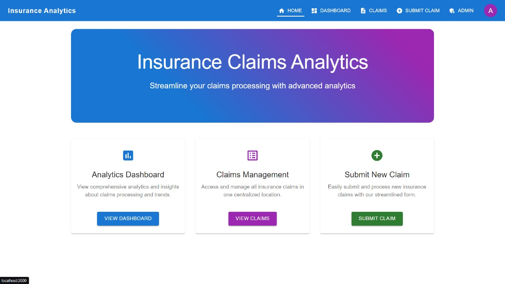
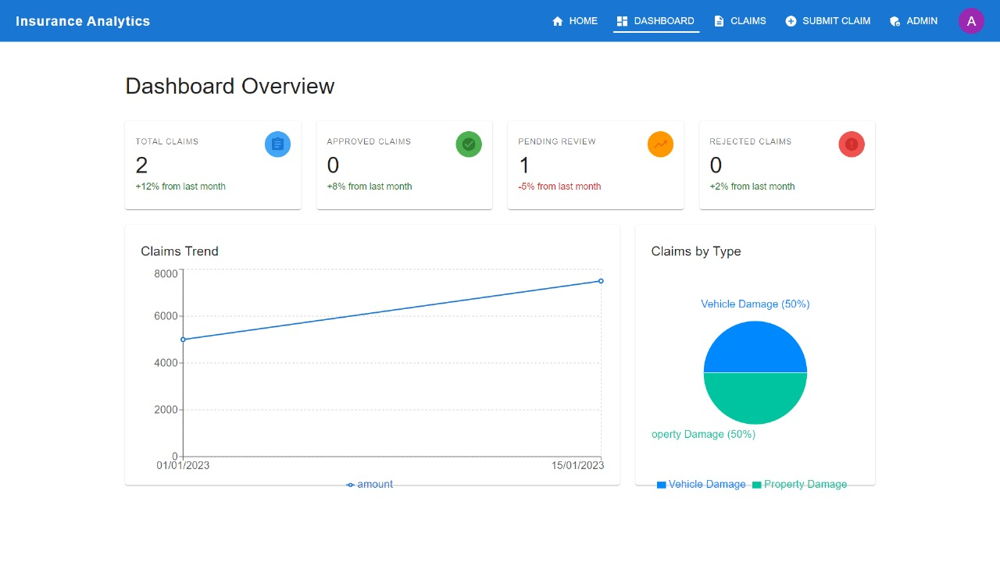
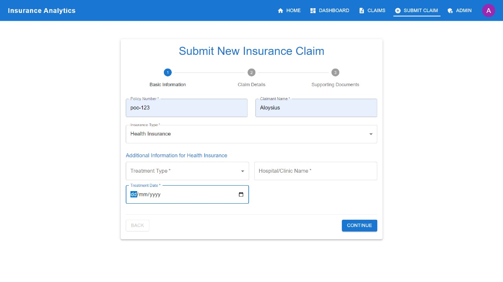
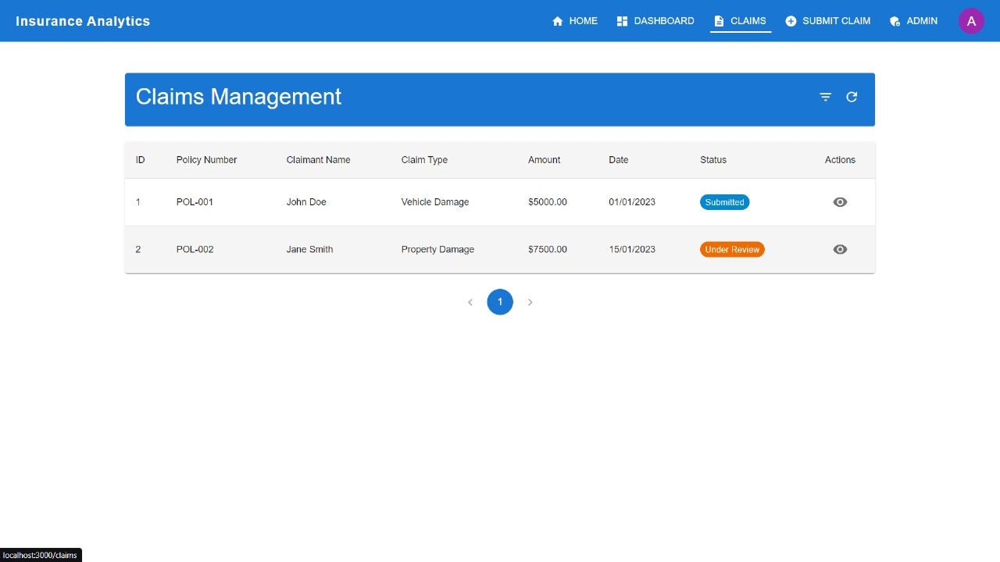
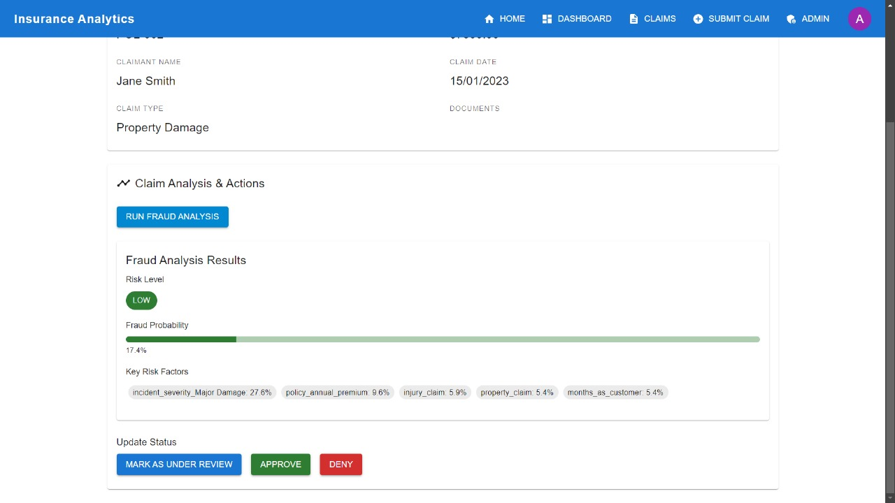
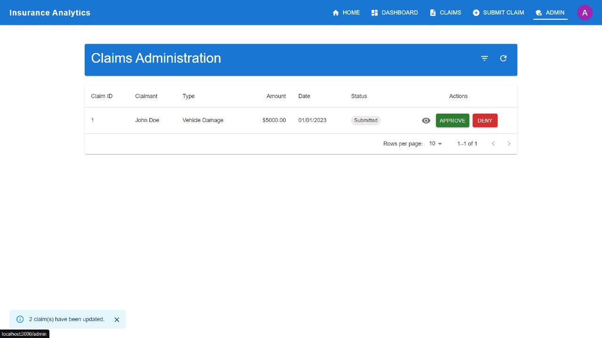

I'll help you create a comprehensive README.md file with a screenshots section. Based on the codebase, I'll create a README that highlights the key features and includes placeholders for screenshots.

```markdown
# Insurance Analytics Platform

A comprehensive web application for managing and analyzing insurance claims with integrated machine learning capabilities for fraud detection.



## Features

### Claims Management
- Submit and track insurance claims
- Upload supporting documents
- Real-time status updates
- Multi-step claim submission process
- Document validation and management

### Analytics Dashboard
- Claims summary visualization
- Risk assessment insights
- Fraud detection analysis
- Performance metrics tracking
- Interactive charts and graphs

### Admin Features
- Claims review and approval workflow
- Fraud analysis tools
- Batch processing capabilities
- User management
- Advanced filtering and sorting

## Screenshots

### Dashboard

*Main dashboard showing claims overview and key metrics*

### Claim Submission

*Multi-step claim submission form with dynamic fields*

### Claims List

*Claims management interface with filtering and sorting*

### Fraud Analysis

*ML-powered fraud detection results and risk assessment*

### Admin Panel

*Administrative interface for claims processing*

## Tech Stack

- Frontend:
  - React 18
  - TypeScript
  - Material-UI (MUI)
  - Recharts for data visualization
  - React Router for navigation

- Backend:
  - Python Flask server
  - Machine Learning models
  - Scikit-learn for fraud detection

## Installation

1. Clone the repository:
```bash
git clone <repository-url>
cd insurance-analytics
```

2. Install frontend dependencies:
```bash
npm install
```

3. Install ML server dependencies:
```bash
cd ml_server
pip install -r requirements.txt
```

## Running the Application

Start both frontend and ML server:

```bash
npm run start-all
```

Or run them separately:

Frontend:
```bash
npm start
```

ML server:
```bash
cd ml_server
python app.py
```

The application will be available at `http://localhost:3000`

## Development

### Available Scripts

- `npm start` - Run frontend in development mode
- `npm test` - Launch test runner
- `npm run build` - Build for production
- `npm run start-dev` - Start both frontend and ML server
- `npm run eject` - Eject from Create React App

### Project Structure

```
insurance-analytics/
├── src/
│   ├── components/      # Reusable UI components
│   ├── pages/          # Page components
│   ├── services/       # API and business logic
│   ├── contexts/       # React contexts
│   └── types/          # TypeScript definitions
├── ml_server/          # Python ML server
└── public/            # Static assets
```

## Contributing

1. Fork the repository
2. Create your feature branch (`git checkout -b feature/AmazingFeature`)
3. Commit your changes (`git commit -m 'Add some AmazingFeature'`)
4. Push to the branch (`git push origin feature/AmazingFeature`)
5. Open a Pull Request

## License

This project is licensed under the MIT License - see the LICENSE file for details.
```

Note: You'll need to:
1. Create a `screenshots` directory in your project
2. Take screenshots of the key interfaces mentioned
3. Add the screenshots to the directory
4. Update the image paths in the README

The screenshots should showcase:
- The main dashboard with charts and metrics
- The claim submission form
- The claims list view
- The fraud analysis results interface
- The admin panel

Would you like me to provide guidance on taking and optimizing the screenshots?